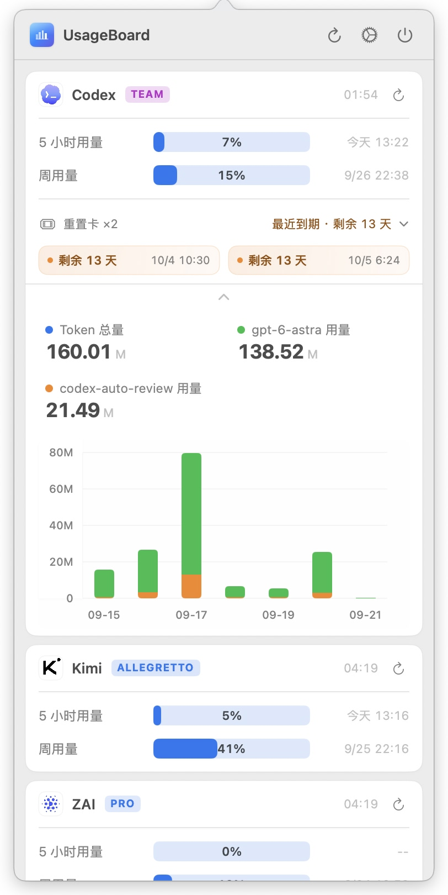

# UsageBoard

**[English](README_EN.md)**

UsageBoard 是一个原生 macOS 菜单栏应用，用于聚合展示 API、模型服务、搜索服务、代理服务等各类用量配额。每个数据源都以插件形式存在，主程序负责定时执行插件、解析 stdout JSON，并以进度条展示用量。

## 功能特性

- 菜单栏常驻，点击图标打开快速预览。
- 支持分组展示和标签页展示。
- 支持手动刷新、定时刷新、单卡片刷新、退出按钮。
- 系统休眠时暂停定时刷新，唤醒后继续调度。
- 插件化用量查询，插件可独立配置刷新间隔和参数。
- 插件图标支持，从元数据配置加载远程图片并缓存。
- 订阅级别徽章显示（黑底白字圆角标签）。
- 插件设置界面从脚本元数据自动生成参数表单，支持分段选择控件和目录选择器。
- 新增插件默认不启用，启用前会检查必填参数。
- 插件数据按 `stateID` 缓存到磁盘，启动后可展示上次成功数据。
- 首次启动会把内置插件安装到用户插件目录。
- 设置页支持开机启动、插件拖拽排序、插件帮助文档、检查更新和在线更新。
- 用量展示支持百分比或数字占比，支持重置时间、进度条颜色，以及可切换折线图/堆叠直方图的 token 统计图。
- 插件可用 `{"error": "错误信息"}` 返回失败原因，错误会直接显示在卡片内容区。
- 支持中英文切换，App UI 和插件元数据均可按语言展示。

## 截图

<table>
  <tr>
    <td></td>
    <td></td>
  </tr>
  <tr>
    <td align="center">Claude 标签页</td>
    <td align="center">MiniMax 标签页</td>
  </tr>
  <tr>
    <td></td>
    <td></td>
  </tr>
  <tr>
    <td align="center">分组展示</td>
    <td align="center">分组展开统计 GLM</td>
  </tr>
  <tr>
    <td></td>
    <td></td>
  </tr>
  <tr>
    <td align="center">分组展开统计 Codex</td>
    <td align="center">插件设置</td>
  </tr>
</table>

## 内置插件

| 插件 | 脚本 | 用途 |
| --- | --- | --- |
| 智谱 | `glm-usage-plugin.py` | 查询智谱 / ZAI Coding Plan 用量和统计 |
| Claude | `claude-usage-plugin.py` | 查询 Claude 订阅用量和统计 |
| Codex | `codex-usage-plugin.py` | 查询 OpenAI Codex CLI 用量和统计 |
| MiniMax | `minimax-usage-plugin.py` | 查询 MiniMax Coding Plan 用量 |
| DeepSeek | `deepseek-usage-plugin.py` | 查询 DeepSeek 账户余额 |
| Kimi | `kimi-usage-plugin.py` | 查询 Kimi Code 用量 |
| Tavily | `tavily-usage-plugin.py` | 查询 Tavily Search 月度用量 |

内置插件源文件位于 [Resources/BundledPlugins](Resources/BundledPlugins)，其中 `_common.py` 是插件共享的公共模块，提供参数解析、翻译、HTTP 错误处理等工具函数。打包后它们会位于 app 包的 `Contents/Resources/Plugins/`。

## 运行时目录

UsageBoard 默认使用：

```text
~/Library/Application Support/UsageBoard/
```

目录内容：

- `config.json`：主配置文件。
- `plugins/`：用户插件目录。添加插件时文件选择器默认打开这里。
- `states/`：插件数据缓存目录。

当前实现会在启动时向 `plugins/` 目录创建内置插件的同名符号链接（以 `_` 开头的内部模块文件除外），来源是 app 包内的 `Contents/Resources/Plugins/`，开发运行时则 fallback 到项目的 `Resources/BundledPlugins/`。

## 配置文件

主配置 JSON 当前结构：

```json
{
  "schemaVersion": 1,
  "language": "zh-Hans",
  "overviewDisplayMode": "tabs",
  "chartMode": "line",
  "launchAtLogin": false,
  "plugins": [
    {
      "stateID": "stable-cache-id",
      "name": "Example",
      "enabled": false,
      "executablePath": "~/Library/Application Support/UsageBoard/plugins/example-plugin.py",
      "refreshIntervalSeconds": 300,
      "metadata": {
        "name": "Example",
        "description": "示例插件",
        "description@zh-Hans": "示例插件",
        "description@en": "Example plugin",
        "parameters": [
          {
            "name": "API_KEY",
            "label": "Api Key",
            "label@zh-Hans": "Api Key",
            "label@en": "API Key",
            "type": "secret",
            "required": true,
            "placeholder": "Service API Key"
          },
          {
            "name": "STAT_PERIOD",
            "label": "统计周期",
            "label@zh-Hans": "统计周期",
            "label@en": "Stats Period",
            "type": "choice",
            "required": true,
            "defaultValue": "7d",
            "options": [
              {"label": "7 天", "label@zh-Hans": "7 天", "label@en": "7 days", "value": "7d"},
              {"label": "15 天", "label@zh-Hans": "15 天", "label@en": "15 days", "value": "15d"},
              {"label": "30 天", "label@zh-Hans": "30 天", "label@en": "30 days", "value": "30d"}
            ]
          }
        ]
      },
      "parameterValues": {
        "API_KEY": "",
        "STAT_PERIOD": "7d"
      }
    }
  ]
}
```

说明：

- `overviewDisplayMode` 支持 `grouped` 和 `tabs`。
- `chartMode` 支持 `line` 和 `bar`。
- `language` 支持 `zh-Hans` 和 `en`，修改后重启生效。
- `launchAtLogin` 控制开机启动。
- `plugins[].stateID` 是插件缓存 ID，会持久化。
- `plugins[].enabled` 为 `false` 时不执行插件。
- `plugins[].metadata` 通常由插件脚本头部注释块解析生成。
- `plugins[].parameterValues` 保存设置界面填写的插件参数。

## 插件开发

插件推荐使用 Python 脚本。主程序执行 `.py` 插件时使用：

```text
/usr/bin/env python3 /path/to/plugin.py --usageboard-param KEY=value --usageboard-param USAGEBOARD_LANGUAGE=zh-Hans
```

插件必须向 stdout 输出 UsageBoard 可解析的 JSON。stderr 可用于调试；退出码非 0、超时或 stdout 非法 JSON 都会显示为插件错误。插件也可以向 stdout 输出 `{"error": "错误信息"}` 表示失败，UsageBoard 会把该错误展示在插件卡片内容区。

更完整的说明见 [插件编写说明](Resources/PluginAuthoringGuide.html)。

### 参数元数据

在脚本开头放入 `UsageBoardPlugin` 注释块，UsageBoard 会读取它并生成设置表单：

```python
#!/usr/bin/env python3
# UsageBoardPlugin:
# {
#   "name": "Example",
#   "icon": "https://example.com/icon.png",
#   "description": "示例插件",
#   "description@zh-Hans": "示例插件",
#   "description@en": "Example plugin",
#   "parameters": [
#     {
#       "name": "API_KEY",
#       "label": "Api Key",
#       "label@zh-Hans": "Api Key",
#       "label@en": "API Key",
#       "type": "secret",
#       "required": true,
#       "placeholder": "Service API Key"
#     },
#     {
#       "name": "STAT_PERIOD",
#       "label": "统计周期",
#       "label@zh-Hans": "统计周期",
#       "label@en": "Stats Period",
#       "type": "choice",
#       "required": true,
#       "defaultValue": "7d",
#       "options": [
#         {"label": "7 天", "label@zh-Hans": "7 天", "label@en": "7 days", "value": "7d"},
#         {"label": "15 天", "label@zh-Hans": "15 天", "label@en": "15 days", "value": "15d"},
#         {"label": "30 天", "label@zh-Hans": "30 天", "label@en": "30 days", "value": "30d"}
#       ]
#     }
#   ]
# }
# /UsageBoardPlugin
```

涉及展示的插件元数据字段支持同级多语言字段，例如 `name@zh-Hans`、`name@en`、`description@zh-Hans`、`description@en`、`label@zh-Hans`、`label@en`、`placeholder@zh-Hans`、`placeholder@en`。当前语言对应字段缺失或为空时，UsageBoard 会回退到不带语言后缀的基础字段。

支持的参数类型：

- `string`
- `secret`
- `integer`
- `boolean`
- `choice`
- `directory`
- `file`

`choice` 参数在设置页显示为分段控件；`directory` 参数显示为路径输入框和文件夹选择器；`file` 参数显示为路径输入框和文件选择器。

插件读取参数示例：

```python
from _common import parse_usageboard_params, get_app_language, make_translator, success, failure

def main():
    params = parse_usageboard_params(sys.argv[1:])
    language = get_app_language(sys.argv[1:])
    translate = make_translator({
        "my_plugin_name": {"zh-Hans": "我的插件", "en": "My Plugin"},
    })

    api_key = params.get("API_KEY")
    if not api_key:
        return failure(translate(language, "missing_api_key"))

    # ... 调用 API ...
    return success(items)

if __name__ == "__main__":
    sys.exit(main())
```

`_common.py` 提供了参数解析（`parse_usageboard_params`）、语言检测（`get_app_language`）、翻译工厂（`make_translator`）、输出函数（`success`/`failure`）、颜色/状态计算（`color_for`/`status_for`/`numeric`）以及统一的 HTTP 错误处理（`handle_http_error`/`handle_url_error`）。新插件应直接引用这些工具，不要重复实现。完整的公共函数列表见 `_common.py` 源码。

UsageBoard 会额外传入当前 app 语言参数：`--usageboard-param USAGEBOARD_LANGUAGE=zh-Hans` 或 `--usageboard-param USAGEBOARD_LANGUAGE=en`。脚本应读取这个保留参数，并直接返回对应语言的展示文本。

### 返回数据格式

```json
{
  "updatedAt": "2026-04-29T00:00:00Z",
  "items": [
    {
      "id": "requests",
      "name": "Requests",
      "used": 1200,
      "limit": 1500,
      "displayStyle": "ratio",
      "resetAt": "2026-04-29T05:00:00Z",
      "status": "normal",
      "color": "blue"
    }
  ],
  "badge": "PRO",
  "chart": {
    "kind": "line",
    "period": "30d",
    "bucketUnit": "day",
    "buckets": [
      {
        "id": "2026-05-01",
        "label": "05-01",
        "segments": [
          {"model": "glm-4.5", "tokens": 1200},
          {"model": "glm-4.6", "tokens": 800}
        ]
      }
    ],
    "message": null
  }
}
```

失败时也可以返回：

```json
{
  "error": "API Key 无效，请检查配置"
}
```

字段说明：

- `updatedAt`：插件数据更新时间，ISO 8601 格式。
- `items[].id`：用量项目稳定 ID。
- `items[].name`：界面显示名称。
- `items[].used` / `items[].limit`：已用量和总额度。
- `items[].displayStyle`：`percent` 显示百分比，`ratio` 显示数字占比。
- `items[].resetAt`：可选重置时间，ISO 8601 格式。
- `items[].status`：`normal`、`warning`、`critical`、`unknown`。
- `items[].color`：可选进度条颜色，支持 `blue`、`yellow`、`orange`、`red`、`green`，缺省蓝色。
- `badge`：可选字符串，显示在插件卡片标题旁的圆角徽章中（白色大写加粗文字）。
- `badgeColor`：可选字符串，徽标颜色，支持 `blue`、`orange`、`gray`、`indigo`、`purple`、`teal`、`green`、`red`、`yellow`；缺省时按 `badge` 文字匹配预设档位（如 PRO/MAX）。
- `chart`：可选 token 统计图，当前支持 `kind: "line"`。
- `chart.period`：统计周期标识，例如 `7d`、`15d`、`30d`。
- `chart.bucketUnit`：时间桶单位，支持 `hour` 或 `day`。
- `chart.buckets[].segments[]`：每个时间桶的模型分段，包含 `model` 和 `tokens`。
- `chart.message`：可选提示文案，统计数据为空或不可用时显示。
- `error`：可选顶层错误信息；存在且非空时，该插件本次运行会被视为失败，错误文本显示在卡片内容区。

内置智谱、Claude 和 Codex 插件提供 `STAT_PERIOD` 参数，支持 `7d`、`15d`、`30d`。智谱插件统一使用国内站 API 查询，兼容智谱和 ZAI 的 Coding Plan Key。Claude 插件通过 OAuth API 获取订阅用量，`PLAN` 参数支持 `none`（无）选项，选择后跳过 API 调用仅返回本地 JSONL 统计数据；本地 token 统计直接按 input、output、cache creation 和 cache read 的实际消耗总和计算，还支持 `CLAUDE_ONLY` 开关过滤第三方模型，并可通过 `DATA_DIR` 指定 `~/.claude` 数据目录。Codex 插件通过 `DATA_DIR` 参数指定数据目录（默认 `~/.codex`），从中读取 `auth.json` 获取认证令牌，并解析会话文件生成 token 统计。Claude 和 Codex 插件使用增量缓存策略，缓存存放在数据目录中，且每次运行都会重新扫描当天数据。DeepSeek 插件提供 `LIMIT` 参数用于设置余额展示上限，并按余额占上限比例显示进度条颜色。Kimi 插件查询 Kimi Code 的 5 小时滚动窗口和周用量，并根据接口返回的会员等级自动显示对应订阅计划；未知等级不显示计划徽标。

## 安装

通过 Homebrew 安装：

```bash
brew tap marsmay/usageboard
brew install --cask usageboard
```

首次打开时，macOS 可能提示"无法验证开发者"。在"系统设置 → 隐私与安全性"中点击"仍要打开"，或在终端执行：

```bash
xattr -cr /Applications/UsageBoard.app
```

## 系统要求

运行：

- macOS 13.0 或更高版本
- 系统可用 `python3`，用于执行 Python 插件

开发：

- Xcode
- Swift 6.3 toolchain

## 构建与测试

Debug 构建：

```bash
swift build
```

运行测试：

```bash
swift test
```

Release 构建：

```bash
swift build -c release
```

本地构建、签名并启动 `dist/UsageBoard.app`：

```bash
bash scripts/build.sh
```

`scripts/build.sh` 会停止正在运行的 UsageBoard，构建 release，复制二进制和内置插件到 `dist/UsageBoard.app`，通过 PlistBuddy 向 Info.plist 注入更新检查 URL，执行 ad-hoc 签名，然后启动 app。可通过 `UB_UPDATE_CHECK_URL` 环境变量自定义更新检查地址。

## 发布

生成并上传新版本：

```bash
bash scripts/release.sh
```

指定版本：

```bash
bash scripts/release.sh 0.1.6
```

发布脚本会：

1. 从 `dist/UsageBoard.app/Contents/Info.plist` 读取当前版本。
2. 生成新版本号。
3. 自动从上个 release tag 到 HEAD 的提交生成更新说明（也可通过第二个参数手动传入）。
4. 构建 release。
5. 复制二进制和内置插件。
6. 通过 PlistBuddy 向 Info.plist 注入更新检查 URL。
7. 重新签名并验证 app。
8. 生成 `UsageBoard-<version>.zip`。
9. 生成 `version.json`。
10. 上传到脚本中配置的服务器路径。
11. 清理远端旧 zip。

当前发布产物示例：

- `dist/UsageBoard-0.1.20.zip`
- `dist/version.json`

## 项目结构

```text
Sources/
  UsageBoardCore/       配置、模型、插件执行、缓存、更新等核心逻辑
  UsageBoardApp/        SwiftUI + AppKit macOS app
Tests/
  UsageBoardTests/      XCTest 单元测试
Resources/
  BundledPlugins/       内置 Python 插件
  PluginAuthoringGuide.html
  UsageBoard.icns
scripts/
  build.sh              本地构建、签名、启动
  release.sh            发布脚本
dist/
  UsageBoard.app        本地测试 app bundle
```

## 许可证

[MIT](LICENSE)
