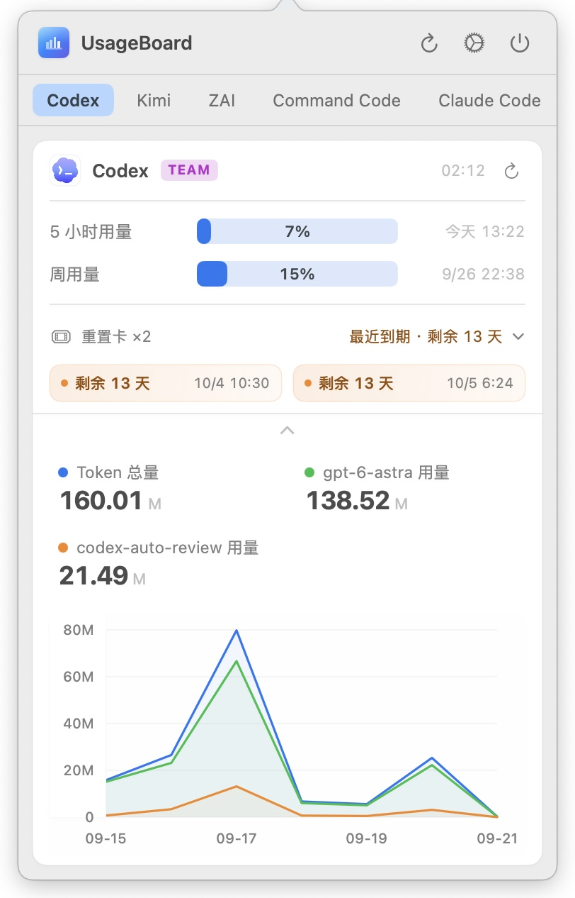
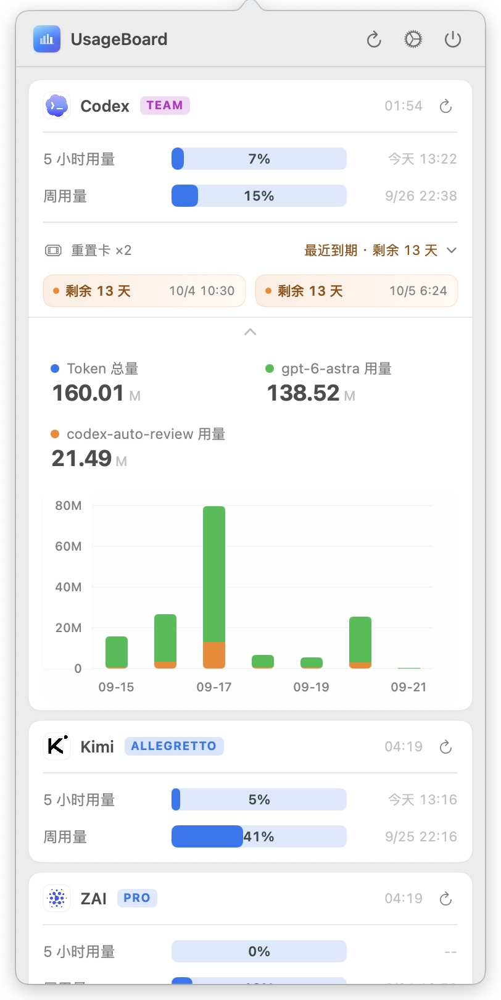

# UsageBoard

**[中文](README.md)** · [Homepage](https://usageboard.may.ltd/)

UsageBoard is a native macOS menu bar app that aggregates quotas, balances, and local usage statistics from APIs, model services, and search services via plugins. The app periodically executes plugins, parses their stdout JSON, and renders usage as progress bars and charts.

## Screenshots

<table>
  <tr>
    <td></td>
    <td></td>
  </tr>
  <tr>
    <td align="center">Claude Tab</td>
    <td align="center">Codex Tab</td>
  </tr>
  <tr>
    <td></td>
    <td></td>
  </tr>
  <tr>
    <td align="center">Grouped View</td>
    <td align="center">Grouped — GLM Chart</td>
  </tr>
  <tr>
    <td></td>
    <td></td>
  </tr>
  <tr>
    <td align="center">Grouped — Codex Chart</td>
    <td align="center">Plugin Settings</td>
  </tr>
</table>

## Features

- Lives in the menu bar; click the icon to open the panel. Grouped or tabbed layouts; drag plugins in Settings → Plugins to change their display order in the panel.
- Progress bars change color with usage; supports percentage or ratio display, reset times, and subscription plan badges.
- Token usage charts switch between line and stacked bar modes.
- Manual, scheduled (per-plugin interval), and per-card refresh; scheduled refresh pauses during system sleep and resumes on wake.
- Plugin data is cached to disk by `stateID`; the last successful data is shown on launch. A plugin can report failure as `{"error": "…"}`, shown directly in the card body.
- Settings forms are generated from script metadata, including segmented controls and directory/file pickers; new plugins are disabled by default and required parameters are validated before enabling. Plugin drafts survive settings tab changes; closing settings offers Save, Discard, or Cancel, and removing a plugin requires confirmation.
- Light, dark, or system theme applied immediately; bundled plugin icons work offline and follow the theme.
- Chinese and English UI; settings fields support standard editing shortcuts (⌘Z / ⇧⌘Z / ⌘X / ⌘C / ⌘V / ⌘A).
- Optional launch at login; background update checks every 6 hours, with an update icon at the top of the popover for new versions and a non-modal panel for download and installation.
- Quitting waits for pending configuration saves; if saving takes longer than 5 seconds, the quit is cancelled and can be retried once saving completes.

## Installation

Requires macOS 13.0 or later and a system-available `python3` (used to execute plugins).

```bash
brew tap marsmay/usageboard
brew install --cask usageboard
```

On first launch, macOS may show a "cannot verify developer" warning. Open **System Settings → Privacy & Security** and click **Open Anyway**, or run:

```bash
xattr -cr /Applications/UsageBoard.app
```

After installation, add and enable the plugins you need under **Settings → Plugins**.

## Bundled Plugins

| Plugin | Script | Purpose |
| --- | --- | --- |
| Zhipu | `glm-usage-plugin.py` | Query Zhipu / ZAI Coding Plan usage and stats |
| Claude | `claude-usage-plugin.py` | Query Claude subscription usage and stats |
| Codex | `codex-usage-plugin.py` | Query OpenAI Codex CLI usage and stats |
| MiniMax | `minimax-usage-plugin.py` | Query MiniMax Coding Plan usage |
| DeepSeek | `deepseek-usage-plugin.py` | Query DeepSeek account balance |
| Kimi | `kimi-usage-plugin.py` | Query Kimi Code usage |
| Tavily | `tavily-usage-plugin.py` | Query Tavily Search monthly usage |
| Command Code | `commandcode-usage-plugin.py` | Query subscription 5-hour, weekly, and monthly usage |

Plugin sources live in [Resources/BundledPlugins](Resources/BundledPlugins) with the shared `_common.py` module; after packaging they reside at `Contents/Resources/Plugins/`. Bundled icons live in [Resources/icons](Resources/icons) — light/dark sets that work offline and follow the theme; the `icon` field uses resource-relative paths such as `icons/light/kimi.png`.

Per-plugin notes:

- **Zhipu**: uses the domestic API endpoint and accepts both Zhipu and ZAI Coding Plan keys. `STAT_PERIOD` supports `none` / `7d` / `15d` / `30d`; `none` disables statistics queries and charts.
- **Claude**: fetches subscription usage via the OAuth API. Setting `PLAN` to `none` skips the API call and returns only local JSONL stats; when both plan and stats period are `none`, the card shows a "No usage data" placeholder. Local token totals sum actual input, output, cache creation, and cache read usage. Session records are deduplicated by message ID and request ID; without a request ID, message ID and session group streaming content blocks, whose different timestamps do not indicate separate requests. Sidechain replays count once, preferring the main record; otherwise the complete usage with the larger token total is used. `CLAUDE_ONLY` filters out third-party models; `DATA_DIR` points at the data directory (default `~/.claude`); `STAT_PERIOD` as above.
- **Codex**: `AUTH_FILE` (default `~/.codex/auth.json`) and `DATA_DIR` (default `~/.codex`) are independent — changing the stats directory does not change the authentication path. Lists the account's currently usable rate-limit reset cards; query failures never affect quota display. `STAT_PERIOD` as above.
- **DeepSeek**: `LIMIT` sets the displayed balance cap; the progress bar is colored by the balance-to-limit ratio.
- **Command Code**: 5-hour and weekly usage come from subscription windows. The monthly cap is estimated as twice the weekly cap; monthly usage is that cap minus the subscription balance, excluding top-ups. The monthly item is omitted without a valid weekly cap.
- **Kimi**: queries the 5-hour rolling window and weekly usage. Select the subscription plan manually — Go / Plus / Pro / Max (gray / indigo / blue / orange badges; defaults to Go). The plugin does not infer membership level from usage responses; the badge is omitted when the plan is unset or invalid.

### Local Statistics and Claude Classifiers

Claude and Codex aggregate local logs; Zhipu chart data comes from its API. Each maintains a versioned statistics cache, rebuilding the last 30 days when upgrading an old cache and then updating incrementally. Failed cache writes preserve the previous file.

Claude classifier stats require no receiving service: launch Claude Code with `AUTOMODE_DECISION_LOG=1 claude`, or add `"AUTOMODE_DECISION_LOG": "1"` to `env` in the user-level `~/.claude/settings.json` and start a new session. Claude appends `.automode_decisions.jsonl` in its working directory when logging first starts. The plugin discovers these files from session `cwd` fields under `DATA_DIR/projects`, reads the four actual token categories for local classifiers, and merges them into the same model names without a chart suffix. No separate log directory is needed; discovery depends on persisted transcripts, so directories used only with `--no-session-persistence` may not be discovered. Keep decision logs out of commits, for example through a local Git exclude rule.

This internal switch was verified with Claude Code 2.1.280 and may change in future versions. Only records written after enabling it are available. Server-side classifier records and records without actual usage are not added, avoiding overlap with main requests. Decision totals already include both stages and some retries; they are not added again. Model fallback may attribute combined usage to the final model. Logs have no request ID: identical records are retained, while paths referring to the same file are deduplicated. Do not keep copied logs in discovered directories. Malformed lines and an unfinished final line are skipped. Classifier usage for the last 30 days is aggregated afresh on each run; deleting a log removes its contribution.

Local statistics can differ from the provider's account total: background requests such as prompt suggestions may be absent from ordinary message records, and other devices or clients may share the account. The plugin recovers attributable background usage from JSONL `cost-state` snapshots only when the session start, all messages, and file modification time fall on one local day. It subtracts already counted main and subagent usage and requires configured model names to match logged models. Models with classifier logs on that day retain the original calculation to avoid duplication. Cross-day, stale, and undatable snapshots are skipped, as are transcripts with undated messages, malformed records, or unreadable subagent logs. Adjustments are recalculated independently of the session cache and do not require the app to stay running.

Parsing draws on [ccusage](https://github.com/ccusage/ccusage) and [CodexBar](https://github.com/steipete/CodexBar). See the [architecture guide](docs/architecture.md#33-token-统计与缓存) for deduplication, cumulative deltas, cache behavior, and adjustment boundaries.

Codex counter resets without explicit boundaries, copied history across files, and unlogged background calls can still cause differences; account totals are not filled in with estimates.

## Plugin Development

Python scripts are recommended. The app executes `.py` plugins with:

```text
/usr/bin/env python3 /path/to/plugin.py --usageboard-param KEY=value --usageboard-param USAGEBOARD_LANGUAGE=en
```

Constraints and behavior:

- Default timeout is 15 seconds; stdout is capped at 8 MiB and stderr retains at most 64 KiB. Timeout, cancellation, or excessive stdout terminates the plugin process group (SIGTERM first, then SIGKILL after at most 1 second) — plugins must not depend on descendants outliving a run.
- Python bytecode caching is disabled to keep the app bundle unchanged.
- A non-zero exit code, forced termination by SIGKILL, or invalid stdout JSON shows as a plugin error. After reaching the time limit, a process that exits during the SIGTERM grace period is handled according to its actual exit code; cancellation always fails the run. Alternatively, output `{"error": "message"}` with exit code 0 to report a failure; the message is shown in the card body.
- `USAGEBOARD_LANGUAGE` is a reserved parameter (`zh-Hans` / `en`); scripts should read it and return display text in the corresponding language.

See the [Plugin Authoring Guide](Resources/PluginAuthoringGuide.html) (bundled with the app) for the full protocol.

### Parameter Metadata

Place the complete `UsageBoardPlugin` JSON comment block, including its closing marker, within the first 80 lines of the script. UsageBoard reads it and generates a settings form:

```python
#!/usr/bin/env python3
# UsageBoardPlugin:
# {
#   "name": "Example",
#   "icon": "https://example.com/icon.png",
#   "description": "Example plugin",
#   "description@zh-Hans": "示例插件",
#   "parameters": [
#     {
#       "name": "API_KEY",
#       "label": "API Key",
#       "type": "secret",
#       "required": true,
#       "placeholder": "Service API Key"
#     }
#   ]
# }
# /UsageBoardPlugin
```

- Parameter types: `string`, `secret`, `integer`, `boolean`, `choice`, `directory`, `file`. `choice` renders as a segmented control when space permits (menu otherwise); `directory` / `file` render as a path field with the corresponding picker.
- Display fields support `@zh-Hans` / `@en` locale variants (e.g. `name@en`, `label@zh-Hans`, `placeholder@en`); when the current language's field is missing or empty, the base field is used.

### Reading Parameters

Bundled plugins reuse `_common.py` (standalone user plugins need `_common.py` alongside the script, or the standalone implementation in the authoring guide):

```python
import sys
from _common import parse_usageboard_params, app_language, make_translator, success, failure

def main():
    params = parse_usageboard_params(sys.argv[1:])
    language = app_language(params)
    translate = make_translator({
        "my_plugin_name": {"zh-Hans": "我的插件", "en": "My Plugin"},
    })

    api_key = params.get("API_KEY")
    if not api_key:
        return failure(translate(language, "missing_api_key"))

    items = []  # Call your API here and build usage items
    return success(items)

if __name__ == "__main__":
    sys.exit(main())
```

`_common.py` provides parameter parsing (`parse_usageboard_params`), language detection (`app_language`), a translation factory (`make_translator`), output helpers (`success` / `failure`), color and status helpers (`color_for` / `status_for` / `numeric`), redirect-free JSON fetches (`fetch_json`), unified error classification (`run_query` / `handle_http_error` / `handle_url_error`), and API key cleanup (`require_api_key`). See its source for the full list.

### Response Data Format

```json
{
  "updatedAt": "2026-04-29T00:00:00Z",
  "items": [
    {
      "id": "requests",
      "name": "Requests",
      "used": 1200,
      "limit": 1500,
      "displayStyle": "ratio",
      "resetAt": "2026-04-29T05:00:00Z",
      "status": "normal",
      "color": "blue"
    }
  ],
  "badge": "PRO",
  "chart": {
    "kind": "line",
    "period": "30d",
    "bucketUnit": "day",
    "buckets": [
      {
        "id": "2026-05-01",
        "label": "05-01",
        "segments": [
          {"model": "glm-4.5", "tokens": 1200},
          {"model": "glm-4.6", "tokens": 800}
        ]
      }
    ],
    "message": null
  }
}
```

On failure:

```json
{ "error": "Invalid API Key. Check your settings." }
```

Field summary (see the authoring guide for full field details):

- `updatedAt` and `items[]`: required. `used` / `limit` / `displayStyle` (`percent` or `ratio`) / `resetAt` / `status` / `color` control each usage row; without a color, the bar follows the usage ratio (blue below 60%, yellow from 60% to below 80%, orange from 80% to below 100%, red at 100%).
- Bundled `_common.color_for` / `color_for_pct` helpers explicitly return blue below 60%, yellow from 60% to below 80%, orange from 80% to below 90%, and red at or above 90%, overriding the app default. DeepSeek has separate rules based on remaining balance.
- `badge` / `badgeColor`: optional title badge. `badgeColor` supports `blue`, `orange`, `gray` (or `grey`), `indigo`, `purple`, `teal`, `green`, `red`, `yellow`; absent values fall back to a text-based preset.
- `credits`: optional array of quota reset cards; include only currently usable cards and omit the field entirely when the query fails.
- `chart`: optional token usage chart using the `kind: "line"` structure with per-bucket model segments; the global `chartMode` selects line or bar rendering, and `chart.message` can carry a hint when stats are empty.
- `error`: optional top-level error; when present and non-empty, the run is treated as failed and the text is shown in the card body.

## Runtime Directory

```text
~/Library/Application Support/UsageBoard/
```

- `config.json`: main configuration (including plugin parameters), saved with owner-only permissions (0600). The `secret` type masks form input only; values are still stored as plain text and passed as command-line arguments.
- `plugins/`: user plugin directory; the file picker defaults here when adding plugins.
- `states/`: successful plugin snapshots saved by the app.
- `plugin-caches/`: Zhipu stats cache, separated by API key hash prefix; Claude/Codex incremental stats caches live at `DATA_DIR/.usageboard-chart-cache.json` instead.

On launch, the app creates symlinks in `plugins/` for bundled plugins (excluding internal modules starting with `_`), pointing at `Contents/Resources/Plugins/` inside the app bundle (or the project's `Resources/BundledPlugins/` during development). Existing regular files with matching names are preserved; existing symlinks are refreshed when the app moves. Replace a symlink with a standalone script to customize a bundled plugin.

`icon` accepts HTTP(S) URLs, absolute file paths, `file://` URLs, and resource-relative paths. Relative paths resolve against the app bundle's `Contents/Resources/` (or the current directory's `Resources/` during development); for `icons/light/` paths, dark mode prefers a same-name `icons/dark/` file and falls back to light, and load failures show the name's initial. Remote icons are limited to 2 MiB with a 10-second inactivity timeout and a 20-second total timeout (transfer bytes only — not decoded pixel memory); oversized or failed loads keep the placeholder.

## Configuration

Main configuration JSON structure:

```json
{
  "schemaVersion": 1,
  "language": "zh-Hans",
  "theme": "system",
  "overviewDisplayMode": "tabs",
  "chartMode": "line",
  "launchAtLogin": false,
  "showUpdateBadge": true,
  "plugins": [
    {
      "stateID": "stable-cache-id",
      "name": "Example",
      "enabled": false,
      "executablePath": "/absolute/path/to/example-plugin.py",
      "refreshIntervalSeconds": 300,
      "metadata": {
        "name": "Example",
        "description": "Example plugin",
        "parameters": [
          {
            "name": "API_KEY",
            "label": "API Key",
            "type": "secret",
            "required": true
          }
        ]
      },
      "parameterValues": {
        "API_KEY": ""
      }
    }
  ]
}
```

- `overviewDisplayMode`: `grouped` / `tabs`; `chartMode`: `line` / `bar` (older configurations default to `line`); `theme`: `light` / `dark` / `system` (missing values default to `system`) — theme changes apply immediately and persist.
- `language`: `zh-Hans` / `en`, takes effect after restart; `launchAtLogin` controls launch at login; `showUpdateBadge` controls whether the popover shows the update icon for new versions (defaults to `true` when absent).
- `plugins[].stateID` is a persistent cache ID; saving script-path, parameter, or metadata changes through settings generates a new one. Startup metadata reloads and direct JSON edits do not rotate it.
- `plugins[].executablePath` must be an actual file path; `~` and shell expressions are not expanded — use the file picker.
- `plugins[].enabled`: when `false`, the plugin is not executed. `plugins[].metadata` is typically parsed from the script header comment block; `plugins[].parameterValues` stores values from the settings UI.

## Build & Test

Development requires Xcode and the Swift 6.3 toolchain:

```bash
swift build                                 # Debug build
swift test                                  # Swift tests
python3 -m unittest discover -s Tests/PluginTests -q      # Plugin tests (uses temporary data and network doubles — no real credentials)
swift build -c release                      # Release build
bash scripts/build.sh                       # Build, sign, and launch dist/UsageBoard.app locally
```

`scripts/build.sh` stops any running UsageBoard instance, builds a release, copies the binary, bundled plugins, help document, and icons into `dist/UsageBoard.app`, injects the update check URL (overridable via `UB_UPDATE_CHECK_URL`), performs ad-hoc signing, and launches the app.

## Release

The release script uploads directly to the server — run it only when publishing. Check the latest tag and pass the intended version explicitly (without a version argument it increments the local bundle's patch version):

```text
bash scripts/release.sh <version> "<release notes>"
```

Before publishing, use the commit history to prepare up to five release notes in Chinese, format each as `1. Description；`, separate them with actual newlines, and pass them explicitly to the script. Use concise, plain language focused on feature changes, usability improvements, and bug fixes. Do not copy commit messages or list implementation details; include technical information only when users need to take action or understand a compatibility impact.

The script builds a release, writes the version and build number, copies resources, signs, generates `UsageBoard-<version>.zip` and `version.json` (with `updatedAt`, `latestVersion`, `latestBuild`, `downloadURL`, `notes`; release notes default to commits since the last tag), deletes existing local `dist/UsageBoard-*.zip` files before creating the new ZIP, uploads to the server, and retains the three most recently modified remote ZIPs (not the three highest semantic versions).

It does not create or push Git tags, publish GitHub Releases, or update the Homebrew cask — complete those steps separately and verify matching versions and zip SHA-256 values across channels. Stop the existing UsageBoard instance before publishing; unlike build.sh, release.sh does not stop or launch the app.

## Project Structure

```text
Sources/
  UsageBoardCore/       Config, models, plugin execution, cache, updates, and core logic
  UsageBoardApp/        SwiftUI + AppKit macOS app
Tests/
  UsageBoardTests/      Core XCTest
  UsageBoardAppTests/   Store, theme, language, icon, and layout XCTest
  PluginTests/          Python plugin tests
  ScriptTests/          Isolated release-script tests
Resources/
  BundledPlugins/       Bundled Python plugins
  icons/                Local light/dark plugin icons
  PluginAuthoringGuide.html
  UsageBoard.icns
scripts/
  build.sh              Local build, sign, and launch
  release.sh            Server release script
  _package_common.sh    Shared packaging logic for build/release
website/                Project homepage static files
dist/
  UsageBoard.app        Local test app bundle
```

See the [architecture guide](docs/architecture.md) for layering, data flow, and validation.

## License

[MIT](LICENSE)
